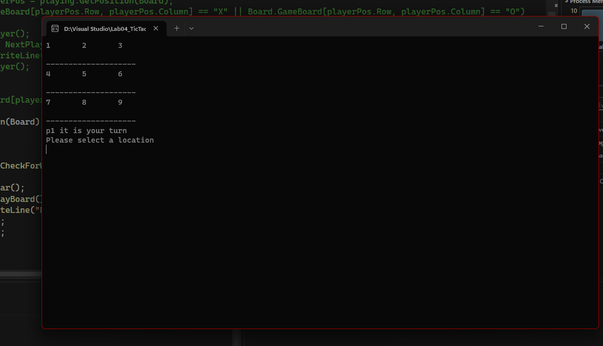
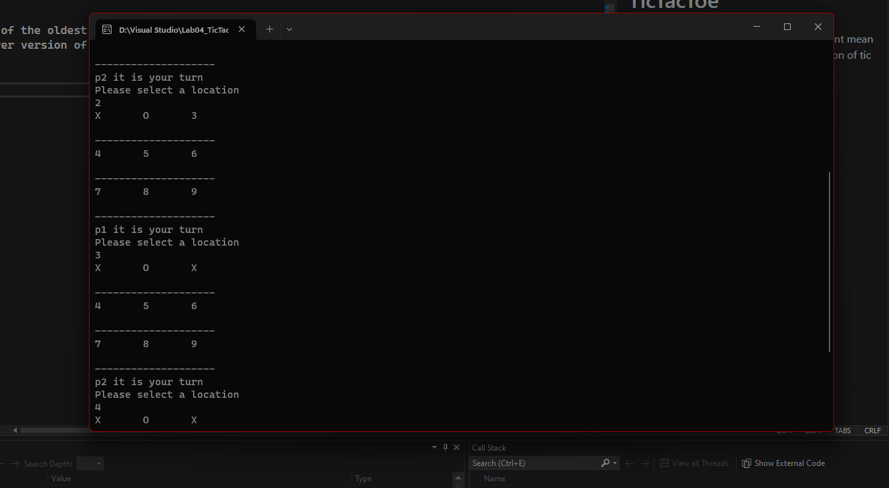
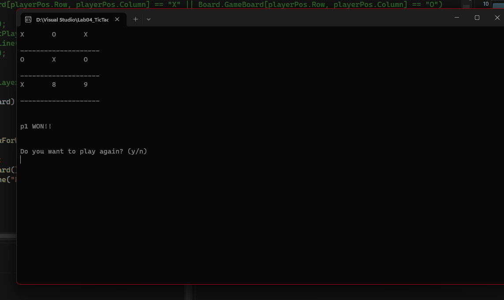
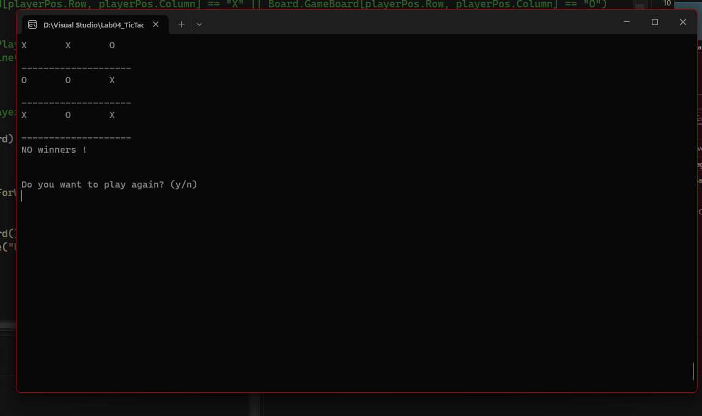

# TicTacToe

this is one of the oldest game but that doesnt mean its not very very popular.
its a 2 player version of tic tac toe. hope you enjoy!

## how to play

1. p1(X) will always start first. use your advantage well
1. input is expected to be a number matching the values shown on screen (1-9)
1. if anything else is inputted you will be prombted to input again
1. once P1 has entered a correct position an X will appear in that spot
1. following that player 2 needs to make an input
1. no overwriting over already chosen spots
1. whenever any of you achives 3 positions than can have a stright line drawn through them a winner will be declared
1. after 9 turns it will be determined if p1 or p2 won or if it was a draw
1. once a game is completed you will be prompted with a question if you would like to play again or not
1. have fun and no rivalries. I would hate to see bloodshed after a TicTacToe
 